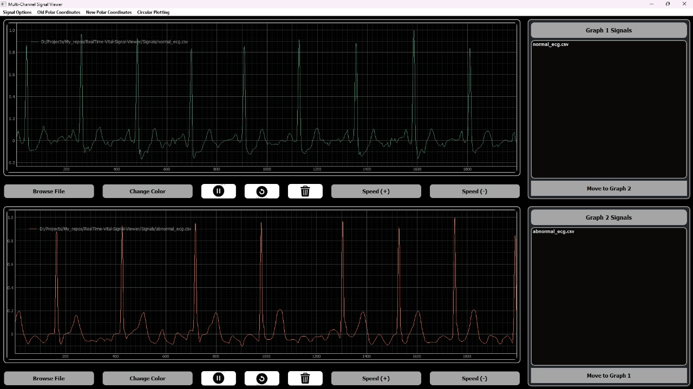
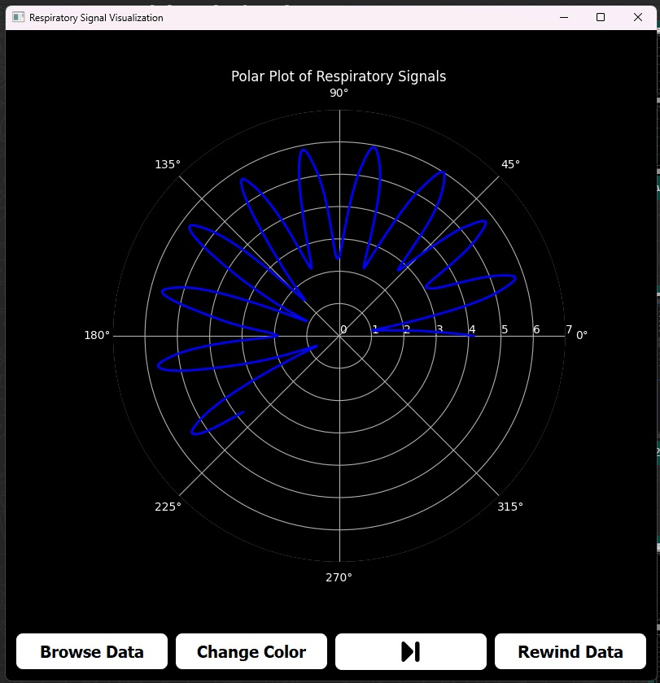
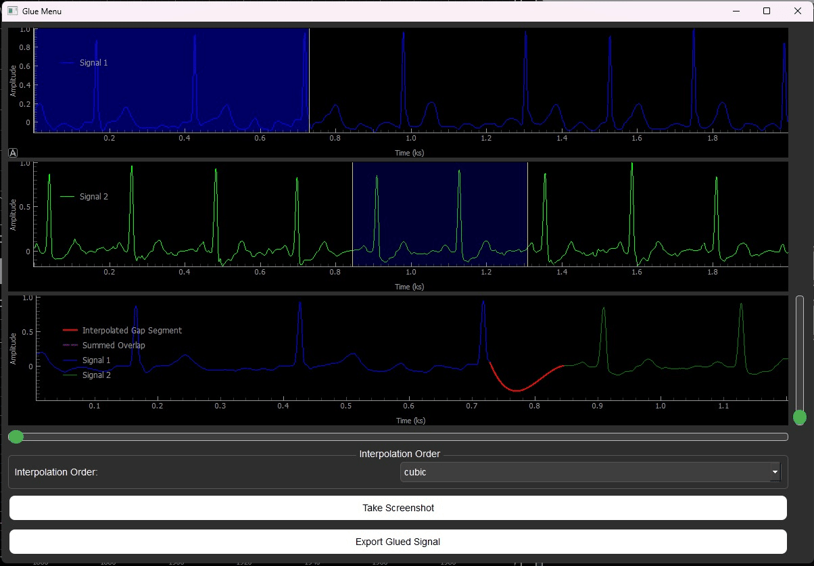
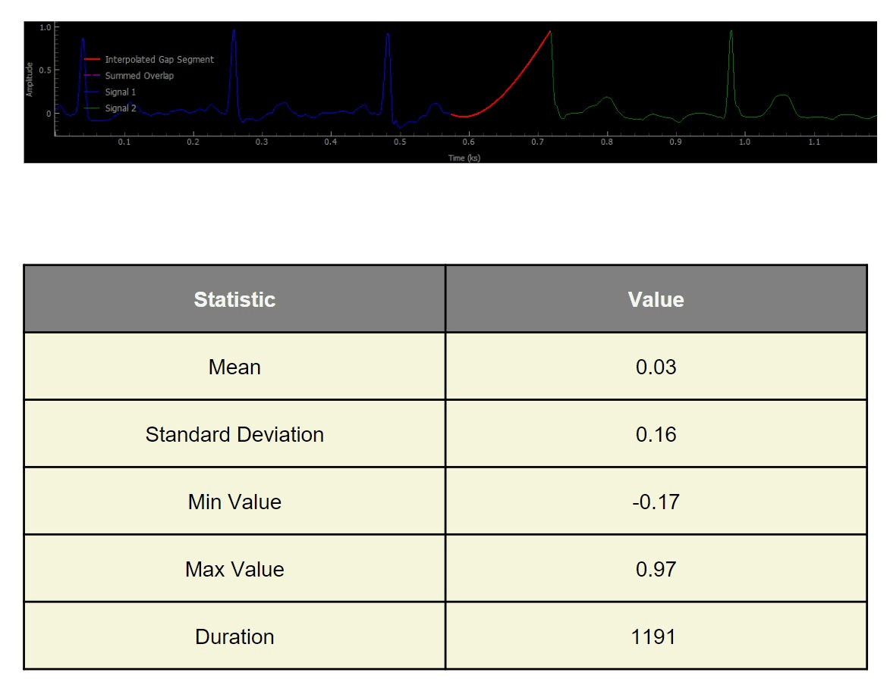

# Multi-Channel Signal Viewer
## Introduction
Signal visualization is a vital tool in many fields, ranging from engineering and science to healthcare and finance. Whether monitoring real-time data from sensors, analyzing recorded signals, or comparing different signal patterns, an efficient signal viewer is essential for extracting meaningful insights.

This project is a Python Qt-based desktop application designed to handle multi-channel signal viewing, offering flexibility, interactivity, and advanced controls for visualizing and analyzing various types of signals.
## Features
- **Signal File Browsing**: Users can browse their PC to open signal files.
- **Independent Graphs**: Two identical graphs allow the user to display different signals, each with independent controls.
- **Graph Linking**: Users can link the two graphs, ensuring synchronized playback, zooming, panning, and viewport adjustments.
- **Cine Mode**: Signals are displayed dynamically. A rewind option is available to restart the signal from the beginning or stop it.
- **Signal Manipulations**:
  - Change signal color.
  - Add titles/labels to signals.
  - Show/hide signals.
  - Adjust cine speed.
  - Pause, play, or rewind signals.
  - Zoom in/out and pan signals.
  - Scroll through signals using sliders.
  - Move signals between the two graphs.
  
*Signal Viewer*

- **Non-Rectangular Visualization**: Provides non-rectangular views of the signal data for advanced insights and visualization beyond standard Cartesian graphs.

*Non-rect. Mode*

- **API Integration**: An API feature allows integration with external systems for importing/exporting signals or interacting with remote signal sources.
- **Boundary Conditions**: Scrolling is restricted within the signal boundaries to prevent empty graphs.

*Gluing Signals*

- **Signal Gluing**: Users can select and cut segments from the two signals displayed in each of the two viewers. These segments can then be glued together to create a continuous signal. This feature enables users to merge different parts of signals, which is useful for combining multiple segments or signals from different sources. Once glued, the new signal behaves as a single, continuous signal for further analysis or visualization.
- **Export and Reporting**:
  - Generate PDF reports with snapshots of graphs and signal statistics.
  - Include data statistics (mean, standard deviation, duration, min, and max values) in a well-structured table.
  - Support single or multi-page PDF reports with an organized layout.
  
  *Signal Statistics*

- **User-Friendly Controls**: Includes intuitive sliders for scrolling, mouse-based panning, and easy-to-use UI elements for a seamless experience.

### **Demo**
https://github.com/user-attachments/assets/f89a9bb0-200c-4408-bb18-b2593b5f4746


## **Setup**

- Clone the repo
```bash
git clone https://github.com/Abdelrahman0Sayed/RealTime-Vital-Signal-Viewer.git
```
- Enter Project Folder
```bash
cd RealTime-Vital-Signal-Viewer
```
- Install the requirements
```bash
pip install -r requirements.txt
```
- Run the Application
```bash
python newSignalViewer.py
```

## Contributors <a name = "Contributors"></a>
<table>
  <tr>
    <td align="center">
    <a href="https://github.com/Abdelrahman0Sayed" target="_black">
    
    <br />
    <sub><b>Abdelrahman Sayed Nasr</b></sub></a>
    </td>
    <td align="center">
    <a href="https://github.com/MahmoudBL83" target="_black">
    
    <br />
    <sub><b>Mahmoud Bahaa</b></sub></a>
    </td>
    <td align="center">
    <a href="https://github.com/momowalid" target="_black">
    
    <br />
    <sub><b>Mohamed Walid</b></sub></a>
    </td>
    <td align="center">
    <a href="https://github.com/Karim12Elbadwy" target="_black">
    
    <br />
    <sub><b>Kareem El-Badawi</b></sub></a>
    </td>
    <td align="center">
    <a href="https://github.com/NadaMohamedElBasel" target="_black">
    
    <br />
    <sub><b>Nada El-Basel</b></sub></a>
    </td>
      </tr>
